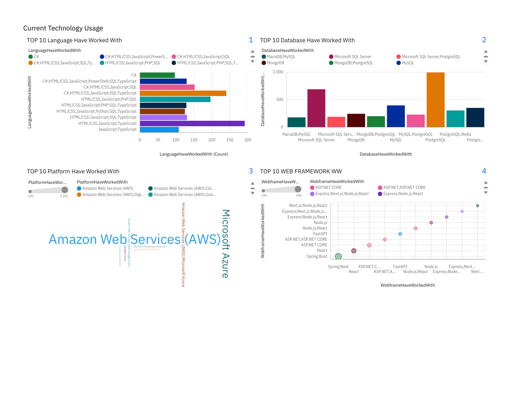

# Tech Trends & Demographics — Data Analytics Capstone

> A full data-analytics lifecycle on the **Stack Overflow Developer Survey** — from API collection and web scraping to cleaning, EDA, and an executive dashboard.



[](https://www.python.org/)
[](https://jupyter.org/)
[](https://matplotlib.org/)

## What This Project Demonstrates

This is an **end-to-end** analytics project — not a single notebook, but the whole pipeline a data analyst runs in practice:

| Stage | What I did |
| --- | --- |
| **Collect** | Pulled data via APIs and web scraping with Python |
| **Wrangle** | Handled missing values, removed duplicates, normalised distributions across a large survey dataset |
| **Explore** | Statistical EDA — distributions, outliers, correlations |
| **Visualise** | Histograms, box plots, scatter/bubble plots, and a stakeholder dashboard |

## The Goal

Uncover shifts in **which technologies and skills developers actually use and want**, so a tech-consulting audience can make evidence-based decisions about where to invest learning and hiring.

## Approach

The notebooks in `notebooks/` walk through each stage in order — collection, cleaning, imputation, EDA, and a full set of visualisation techniques — ending in a summary dashboard for non-technical stakeholders.

## Repository Structure

```
├── notebooks/    Step-by-step lifecycle (collection → cleaning → EDA → visualisation)
├── dashboard/    Final dashboard export (PDF)
└── images/       Dashboard preview
```

## Run It Yourself

1. Open the `notebooks/` in order to follow the methodology and code.
2. View the PDF in `dashboard/` (or the preview above) for the summarised findings.

---

**Baxolele Mazwi** — BSc Construction student at Wits & aspiring data scientist
[Portfolio](https://mazwiibaxolele.github.io/mazwi-portfolio/) · [LinkedIn](https://linkedin.com/in/baxolele-mazwi-9b2322267)
